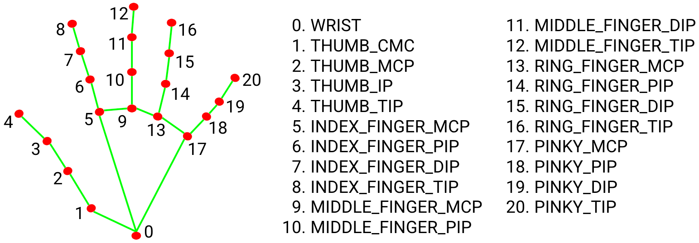

A project to translate sign language gestures into real-time subtitles using AI and computer vision.

## Hand Landmarks Reference

This project uses MediaPipe hand landmark coordinates as shown below:

