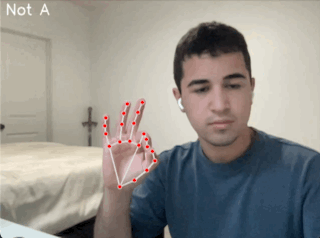

A project to translate sign language gestures into real-time subtitles using AI and computer vision.

Quick demo of my Sign Language  Subtitle AI detecting the letter A.
(And yes, that is a sword in the background, doesn’t everyone keep one in their room in case the crusaders come back?)

## Demo

  

## Hand Landmarks Reference

This project uses MediaPipe hand landmark coordinates as shown below:

